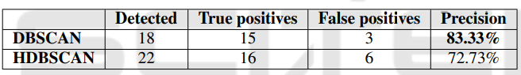
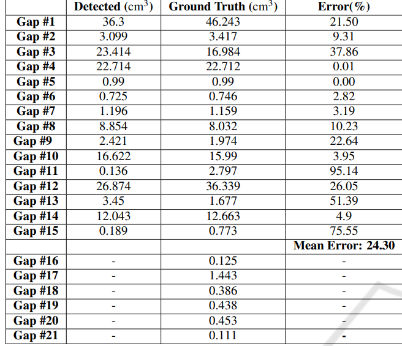

# Gap Detection in Electronic Devices to Assist Autonomous Disassembly Processes

A ROS package for detecting gaps in electronic devices using point cloud data, designed to assist automated disassembly processes.

## Paper

This work is based on the paper:

**"A Visual Intelligence Scheme for Hard Drive Disassembly in Automated Recycling Routines"**

*Erenus Yildiz, Tobias Brinker, Erwan Renaudo, Jakob J. Hollenstein, Simon Haller-Seeber, Justus Piater, and Florentin Wörgötter*

Published in: **Proceedings of the International Conference on Robotics, Computer Vision and Intelligent Systems (ROBOVIS 2020)**, pages 17-27

DOI: [10.5220/0010016000170027](https://doi.org/10.5220/0010016000170027)  
ISBN: 978-989-758-479-4

**Citation:**
```bibtex
@inproceedings{yildiz2020visual,
  title={A Visual Intelligence Scheme for Hard Drive Disassembly in Automated Recycling Routines},
  author={Yildiz, Erenus and Brinker, Tobias and Renaudo, Erwan and Hollenstein, Jakob J. and Haller-Seeber, Simon and Piater, Justus and W{\"o}rg{\"o}tter, Florentin},
  booktitle={Proceedings of the International Conference on Robotics, Computer Vision and Intelligent Systems (ROBOVIS 2020)},
  pages={17--27},
  year={2020},
  organization={SCITEPRESS}
}
```

## �🚀 Quick Start

**New to this package?** Check out [QUICKSTART.md](QUICKSTART.md) for a 5-minute setup guide!

**TL;DR with Docker:**
```bash
cd ~/gap_detection
./docker-run.sh build
./docker-run.sh run --bag-file /path/to/your/data.bag
```

## Table of Contents
- [Overview](#overview)
- [How It Works](#how-it-works)
- [Hardware Setup](#hardware-setup)
- [Prerequisites](#prerequisites)
- [Installation](#installation)
- [Usage](#usage)
- [Configuration](#configuration)
- [Evaluation Results](#evaluation-results)
- [Development](#development)

## Overview

This package provides gap detection capabilities using stereo camera point clouds. It includes:
- Point cloud preprocessing and filtering
- Gap detection and segmentation using DBSCAN clustering
- 3D visualization in RViz
- Dynamic parameter reconfiguration
- Support for both live camera data and recorded rosbag files

The gap detection system analyzes top-view point-cloud representations to identify and measure gaps in electronic devices, designed specifically for automated disassembly processes.

## How It Works

### Detection Pipeline

The gap detection relies on the top-view point-cloud representation of the scene acquired by the stereo camera. The overall process consists of the following stages:


**1. Passthrough Filtering**
- Defines a region of interest (ROI) as a box-shaped volume
- Discards points outside the volume where the device should be positioned
- Removes artifacts and irrelevant background data

**2. Denoising**
- Uses Sparse Outlier Removal (SOR) algorithm (Rusu et al., 2008)
- Identifies outlier points based on their mean distance to nearest neighbors
- Parameters: `MeanK` (number of neighbors) and `StdDevMulThresh` (standard deviation threshold)

**3. Depth-Based Classification**
- Analyzes the denoised point-cloud depth distribution
- Classifies points into surface points and gap points
- The existence of gaps produces a bi-modal depth distribution between:
  - Foreground points (surface)
  - Background points (gaps)
- Automatic threshold computation using Otsu's method (Otsu, 1979)

**4. Clustering**
- Uses DBSCAN (Density-Based Spatial Clustering of Applications with Noise)
- Groups candidate gap points into separate gaps
- Filters out spaces too small to be interesting gaps
- Provides location and size information for each gap

**5. Volume Correction**
- **First Pass**: Convex hull algorithm determines 2D boundaries of each gap
- **Artificial Points**: Boundary points are duplicated with height set to median surface height
- **Second Pass**: Convex hull algorithm provides corrected 3D gap volumes
- Filters very small volumes that cannot be actual gaps

**6. Gap Characterization**
- Gap centers estimated as the mean of extrema for every axis
- Outputs gap information including centers, volumes, and boundaries
- Results sent to the rest of the disassembly pipeline

  
*Figure: Detected gaps without (left) and with (right) volume correction.*

### Algorithm Comparison: DBSCAN vs HDBSCAN

We evaluated two state-of-the-art clustering algorithms:

- **DBSCAN** (Density-Based Spatial Clustering): Used in the current implementation
- **HDBSCAN** (Hierarchical DBSCAN): Alternative approach tested

**Results over 12 hard drives with 21 gaps:**

| Metric | DBSCAN | HDBSCAN |
|--------|--------|---------|
| Gaps Identified | 18/21 (85.7%) | 22/21 (1 false positive) |
| Correct Identifications | 15/21 | 16/21 |
| Precision | 83.33% | 72.73% |
| Quality | Higher | Lower |

**Conclusion**: DBSCAN was chosen for the final implementation due to:
- Higher precision (fewer false positives)
- Better quality gap detection results
- More reliable performance across different devices

## Hardware Setup

The system uses an automated setup with a tilting table for optimal viewing angles:

- **Horizontal position**: Surface normal aligned with RGB camera (for monocular imaging)
- **45° tilt**: Aligned with RGB-D stereo camera (for point cloud acquisition)

### Cameras

**Monocular Camera** (RGB imaging):
- Model: Basler acA4600-7gc
- Resolution: 4608 × 3288 pixels
- Frame rate: 3.5 FPS

**Stereo Camera** (Point cloud):
- Model: Nerian Karmin2
- Depth error: 0.06 cm from minimum range
- Minimum range: 35 cm
- Provides top-down point-cloud data for gap detection

## Prerequisites

- Ubuntu 20.04 or 22.04
- ROS Noetic (see installation instructions below)
- Python 3.8+
- PCL (Point Cloud Library)
- Camera driver (if using live camera) or rosbag file

## Installation

### Option 1: Docker Installation (Recommended for Ubuntu 22.04)

Due to ROS Noetic dependency issues on Ubuntu 22.04, using Docker is recommended:

1. **Install Docker** (if not already installed):
   ```bash
   curl -fsSL https://get.docker.com -o get-docker.sh
   sudo sh get-docker.sh
   sudo usermod -aG docker $USER
   # Log out and back in for group changes to take effect
   ```

2. **Build and run the Docker container**:
   ```bash
   cd ~/gap_detection
   # Docker setup coming soon - for now, follow Option 2
   ```

### Option 2: Native Installation (Ubuntu 20.04)

1. **Install ROS Noetic**:
   ```bash
   sudo sh -c 'echo "deb http://packages.ros.org/ros/ubuntu $(lsb_release -sc) main" > /etc/apt/sources.list.d/ros-latest.list'
   sudo apt install curl
   curl -s https://raw.githubusercontent.com/ros/rosdistro/master/ros.asc | sudo apt-key add -
   sudo apt update
   sudo apt install ros-noetic-desktop-full
   ```

2. **Initialize rosdep**:
   ```bash
   sudo apt install python3-rosdep
   sudo rosdep init
   rosdep update
   ```

3. **Set up ROS environment**:
   ```bash
   echo "source /opt/ros/noetic/setup.bash" >> ~/.bashrc
   source ~/.bashrc
   ```

4. **Create a catkin workspace** (if you don't have one):
   ```bash
   mkdir -p ~/catkin_ws/src
   cd ~/catkin_ws/
   catkin_make
   echo "source ~/catkin_ws/devel/setup.bash" >> ~/.bashrc
   source ~/.bashrc
   ```

5. **Clone and link the package**:
   ```bash
   cd ~/catkin_ws/src
   ln -s ~/gap_detection ugoe_gap_detection_ros
   ```

6. **Install dependencies**:
   ```bash
   cd ~/catkin_ws
   rosdep install --from-paths src --ignore-src -r -y
   
   # Install Python dependencies
   cd ~/gap_detection
   pip3 install -r requirements.txt
   ```

7. **Build the package**:
   ```bash
   cd ~/catkin_ws
   catkin_make
   source devel/setup.bash
   ```

## Usage

### Using with Rosbag (Default Mode)

The package is configured to use rosbag files by default. This allows you to test the gap detection without a physical camera.

1. **Basic usage with a rosbag file**:
   ```bash
   roslaunch ugoe_gap_detection_ros ugoe_gap_detection_ros.launch bag_file:=/path/to/your/rosbag.bag
   ```

2. **With looping and custom playback rate**:
   ```bash
   roslaunch ugoe_gap_detection_ros ugoe_gap_detection_ros.launch \
       bag_file:=/path/to/your/rosbag.bag \
       bag_loop:=true \
       bag_rate:=0.5
   ```

3. **Start from a specific time**:
   ```bash
   roslaunch ugoe_gap_detection_ros ugoe_gap_detection_ros.launch \
       bag_file:=/path/to/your/rosbag.bag \
       bag_start:=10.0
   ```

4. **Disable visualization for headless operation**:
   ```bash
   roslaunch ugoe_gap_detection_ros ugoe_gap_detection_ros.launch \
       bag_file:=/path/to/your/rosbag.bag \
       enable_rviz:=false \
       enable_rqt:=false
   ```

### Using with a Live Camera

To use a real stereo camera instead of rosbag:

1. **Switch to camera mode**:
   ```bash
   roslaunch ugoe_gap_detection_ros ugoe_gap_detection_ros.launch use_rosbag:=false
   ```

2. **Make sure your camera driver is running** and publishing to `/nerian_stereo/point_cloud` (or remap the topic):
   ```bash
   # In a separate terminal, launch your camera driver
   roslaunch your_camera_package camera.launch
   
   # Then launch gap detection
   roslaunch ugoe_gap_detection_ros ugoe_gap_detection_ros.launch use_rosbag:=false
   ```

3. **Use a custom topic name**:
   ```bash
   roslaunch ugoe_gap_detection_ros ugoe_gap_detection_ros.launch \
       use_rosbag:=false \
       input_topic:=/your/custom/pointcloud/topic
   ```

### Creating a Rosbag from Camera Data

If you have a camera and want to record data for later use:

```bash
# Record the point cloud topic
rosbag record /nerian_stereo/point_cloud -O my_recording.bag

# Record multiple topics
rosbag record /nerian_stereo/point_cloud /tf /tf_static -O my_recording.bag
```

## Configuration

### Dynamic Reconfiguration

Use the rqt_reconfigure GUI to adjust parameters in real-time:

**Preprocessing parameters:**
- `xLowerLimit`, `xUpperLimit`: X-axis pass-through filter bounds
- `yLowerLimit`, `yUpperLimit`: Y-axis pass-through filter bounds  
- `zLowerLimit`, `zUpperLimit`: Z-axis pass-through filter bounds
- `MeanK`: Number of nearest neighbors for statistical outlier removal
- `StdDevMulThresh`: Standard deviation multiplier threshold

**Gap detection parameters:**
- Configured via `cfg/detector.cfg`

### Configuration Files

- `cfg/detector.cfg`: Gap detection dynamic reconfigure parameters
- `cfg/preprocessing.cfg`: Preprocessing dynamic reconfigure parameters
- `cfg/HDDTable_ROI.yaml`: Region of interest for HDD table
- `cfg/KITGripper_ROI.yaml`: Region of interest for KIT gripper

## Launch File Parameters

| Parameter | Default | Description |
|-----------|---------|-------------|
| `use_rosbag` | `true` | Use rosbag file instead of live camera |
| `bag_file` | `""` | Path to rosbag file |
| `bag_loop` | `false` | Loop the rosbag playback |
| `bag_rate` | `1.0` | Playback speed multiplier |
| `bag_start` | `0.0` | Start time offset in seconds |
| `input_topic` | `/nerian_stereo/point_cloud` | Input point cloud topic |
| `enable_rviz` | `true` | Launch RViz visualization |
| `enable_rqt` | `true` | Launch rqt_reconfigure GUI |

## Evaluation Results

### Ground Truth Creation

To evaluate the performance of the gap detector, ground truth annotations were created using a Semantic Segmentation Editor. All point clouds from the stereo cameras were annotated with point-wise segmentations of each gap. The denoised point clouds were used for annotation to ensure comparable point numbers.

### Performance Metrics

The gap detector was evaluated on 12 hard disk drives with a total of 21 gaps, using the same parameter set across all devices to test generalization capability.

  
*Table: Comparison of the DBSCAN-powered detector's output and ground truth annotations.*

**Overall Performance:**
- **Mean Volume Error**: 24.30% among identified gaps
- **Standard Deviation**: 28.14
- **Variance**: 791.85

**Detection Rate:**
- Successfully identified: 18/21 gaps (85.7%)
- Correctly classified: 15/21 gaps (71.4%)
- Precision: 83.33%

**Important Notes:**
- Gaps marked as "-" in the table were not detectable due to hardware limitations of the camera (extremely small gaps beyond sensor resolution)
- These undetectable gaps were excluded from calculations as they are typically irrelevant to the disassembly routine
- Parameters were intentionally kept fixed across all devices to test generalization
- Device-specific parameter tuning can improve results and correct misclassifications

### Limitations

The current system has the following known limitations:

1. **Sensor Constraints**: Very small gaps may not be detectable due to stereo camera resolution and minimum depth range (35cm)
2. **Depth Occlusion**: Gaps that are occluded or at extreme angles may not be properly captured
3. **Parameter Sensitivity**: While fixed parameters work across devices, optimal performance requires some tuning
4. **Surface Requirements**: Best performance on devices with clear depth discontinuities

## Development

### Running Tests

```bash
cd ~/gap_detection
python3 -m pytest tests/
```

### Package Structure

```
gap_detection/
├── cfg/                    # Configuration files
├── evaluation/             # Evaluation scripts
├── launch/                 # ROS launch files
├── src/                    # Source code
│   ├── gap_detection_core.py    # Core gap detection logic
│   ├── gap_detector.py           # ROS node for gap detection
│   ├── helpers.py                # Helper functions
│   ├── preprocessing_node.cpp   # Point cloud preprocessing
│   └── visualization.py          # Visualization utilities
├── srv/                    # ROS service definitions
├── tests/                  # Unit tests
├── CMakeLists.txt
├── package.xml
└── README.md
```

### Service Interface

The package provides a service for gap detection:

```bash
rosservice call /ugoe_gap_detection_ros/detect_gaps
```

## Troubleshooting

### No Point Cloud Data Received

- **Rosbag mode**: Ensure the bag file path is correct and the file exists
- **Camera mode**: Verify the camera driver is running: `rostopic list | grep point_cloud`
- Check topic name matches: `rostopic echo /nerian_stereo/point_cloud`

### Build Errors

- Make sure all dependencies are installed: `rosdep install --from-paths src --ignore-src -r -y`
- Clean and rebuild: `cd ~/catkin_ws && catkin_make clean && catkin_make`

### Python Dependency Issues

```bash
pip3 install -r requirements.txt --user
```

### ROS Not Found

Make sure ROS is sourced:
```bash
source /opt/ros/noetic/setup.bash
source ~/catkin_ws/devel/setup.bash
```

## Contributing

1. Create a feature branch from `main`
2. Make your changes
3. Run tests: `python3 -m pytest tests/`
4. Submit a pull request

## References

- **Sparse Outlier Removal**: Rusu, R. B., et al. (2008). "Towards 3D Point Cloud Based Object Maps for Household Environments." Robotics and Autonomous Systems.

- **Otsu's Thresholding**: Otsu, N. (1979). "A Threshold Selection Method from Gray-Level Histograms." IEEE Transactions on Systems, Man, and Cybernetics.

- **DBSCAN Clustering**: Ester, M., et al. (1996). "A Density-Based Algorithm for Discovering Clusters in Large Spatial Databases with Noise." KDD-96 Proceedings.

## License

This project is licensed under the MIT License - see the [LICENSE](LICENSE) file for details.

## Maintainer & Contact

**Erenus Yildiz**  
Email: erenus.yildiz@hotmail.com

## Affiliations

This work was developed in collaboration between:
- **Georg-August University of Göttingen** - III. Physics Institute, Germany
- **University of Innsbruck** - Department of Computer Science, Austria
